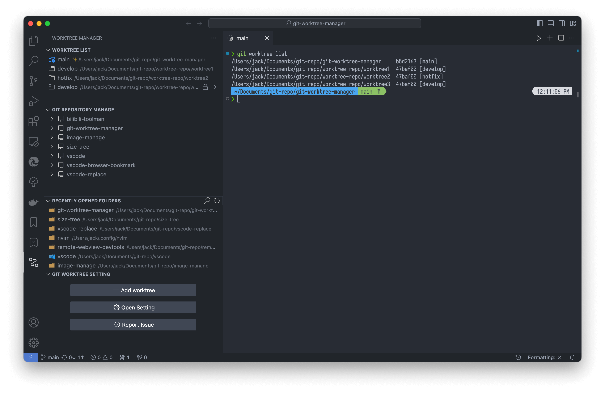

# VSCode Git Worktree Manager

简体中文 | [English](./README.md)

**在 Visual Studio Code 中安全、高效地管理 Git worktree。**  
轻松创建、切换和清理 worktree，同时保持分支关系清晰可控。

## Support 💖

如果这个插件帮到了你，请点个 [star ⭐](https://github.com/jackiotyu/git-worktree-manager) 吧！

<table>
  <tr>
    <td align="center">
       
      <b>PayPal</b>
    </td>
    <td align="center">
       
      <b>微信</b>
    </td>
  </tr>
</table>

## 为什么选择 Git Worktree Manager？🌟

Git worktree 可以将不同分支隔离在独立目录中，让并行开发更加清晰，  
但在命令行中手动管理这些 worktree 往往繁琐且容易出错。

Git Worktree Manager 将 worktree 管理能力直接集成到 VS Code 中，  
帮助你安全地创建、切换和清理 worktree，同时保持仓库结构清晰可控。

<video src="./images/manage-multiple-repositories.mp4" controls="controls" width="800" height="450"></video>
> [在 VSCode 中轻松管理多个仓库。](./images/manage-multiple-repositories.mp4)

### 核心功能 🎯
- **快速切换 Worktree**：使用 `Ctrl+Shift+R` 或源代码管理视图快速切换 Worktree。 
  <video src="https://cdn.jsdelivr.net/gh/jackiotyu/git-worktree-manager@0.4.6/images/switch-branch.mp4" controls="controls" width="800" height="450"></video> 
  > [一键无缝切换分支。](https://cdn.jsdelivr.net/gh/jackiotyu/git-worktree-manager@0.4.6/images/switch-branch.mp4) 
- **轻松创建 Worktree**：无需命令行，直接在 VSCode 中创建 Worktree。 
  <video src="https://cdn.jsdelivr.net/gh/jackiotyu/git-worktree-manager@0.4.6/images/create-worktree.mp4" controls="controls" width="800" height="450"></video> 
  > [几秒钟内创建新 Worktree。](https://cdn.jsdelivr.net/gh/jackiotyu/git-worktree-manager@0.4.6/images/create-worktree.mp4) 
- **工作区集成**：将 Worktree 添加到 VSCode 工作区，轻松访问。 
  <video src="https://cdn.jsdelivr.net/gh/jackiotyu/git-worktree-manager@0.4.6/images/add-worktrees-to-workspace.mp4" controls="controls" width="800" height="450"></video> 
  > [一键将 Worktree 添加到工作区。](https://cdn.jsdelivr.net/gh/jackiotyu/git-worktree-manager@0.4.6/images/add-worktrees-to-workspace.mp4) 
- **收藏夹管理**：保存常用 Worktree，方便快速访问。 
  <video src="https://cdn.jsdelivr.net/gh/jackiotyu/git-worktree-manager@0.4.6/images/drop-to-favorites.mp4" controls="controls" width="800" height="450"></video> 
  > [将 Worktree 拖入收藏夹，随时访问。](https://cdn.jsdelivr.net/gh/jackiotyu/git-worktree-manager@0.4.6/images/drop-to-favorites.mp4) 
- **复制未跟踪文件**：创建 Worktree 时自动复制主仓库的未跟踪文件。
- **多语言支持**：支持英语、简体中文、繁体中文和日语。
- **自定义终端**：支持 macOS 的 iTerm 或 Windows 的 Git Bash 等终端。

## 快速上手 🚀

1. **使用要求**
   - git version >= 2.40

1. **安装扩展**：
   - 从 [Visual Studio Marketplace](https://marketplace.visualstudio.com/items?itemName=jackiotyu.git-worktree-manager) 或者 [Open VSX Registry](https://open-vsx.org/extension/jackiotyu/git-worktree-manager) 下载。
   - 或在 VSCode 扩展视图中搜索 "Git Worktree Manager" 并安装。

1. **快速开始**：
   - 在 Git 仓库中打开 VSCode。
   - 按 `Ctrl+Shift+R` 启动 Worktree 管理器。
   - 使用直观界面创建、切换或删除 Worktree。

1. **示例工作流**：
   - 创建新 Worktree：选择“创建 Worktree”并指定分支。
   - 通过源代码管理视图或命令面板即时切换。
   - 将 Worktree 添加到 VSCode 工作区，同时处理多个分支。
   - 保存到收藏夹以便日后快速访问。

## 配置 ⚙️

根据你的工作流程自定义 Git Worktree Manager：

- **`git-worktree-manager.treeView.toSCM`**  
  在源码管理（Source Control）视图中显示 worktree。

- **`git-worktree-manager.worktreeCopyPatterns`**  
  指定在创建新 worktree 时需要复制的文件或目录  
  （例如本地配置文件或环境相关资源）。  
  **示例:** `[".env.local", "config/*.json"]`

- **`git-worktree-manager.worktreeCopyIgnores`**  
  在创建 worktree 时排除某些文件或路径，即使它们匹配 `worktreeCopyPatterns`。  
  **示例:** `["node_modules", "dist"]`

- **`git-worktree-manager.postCreateCmd`**  
  在创建 worktree 后自动执行的命令  
  （例如安装依赖或运行初始化脚本）。  
  **示例:** `"pnpm install"` 或 `"echo 'Worktree 已就绪'"`

- **`terminal.external.windowsExec`**  
  设置 Windows 系统下的外部终端  
  （例如 Git Bash: `"C:\\Program Files\\Git\\bin\\bash.exe"`）。

- **`terminal.external.osxExec`**  
  设置 macOS 系统下的外部终端  
  （例如 iTerm: `"iTerm.app"`）。

## 贡献 🤝

我们欢迎贡献！参与方式：
1. 克隆仓库。
2. 创建功能分支（`git checkout -b feature/awesome-idea`）。
3. 提交更改（`git commit -m "添加新功能"`）。
4. 推送分支（`git push origin feature/awesome-idea`）。
5. 提交 Pull Request。

有好主意？请在 [issues](https://github.com/jackiotyu/git-worktree-manager/issues) 中创建“enhancement”标签的问题。

## 许可证 📜

采用 [MIT 许可证](LICENSE) 分发，欢迎自由使用、修改和分享！
